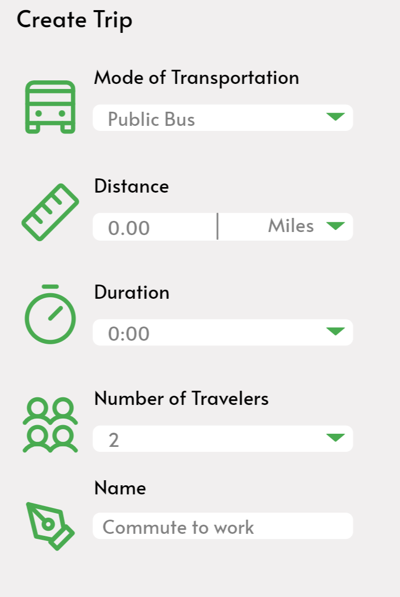
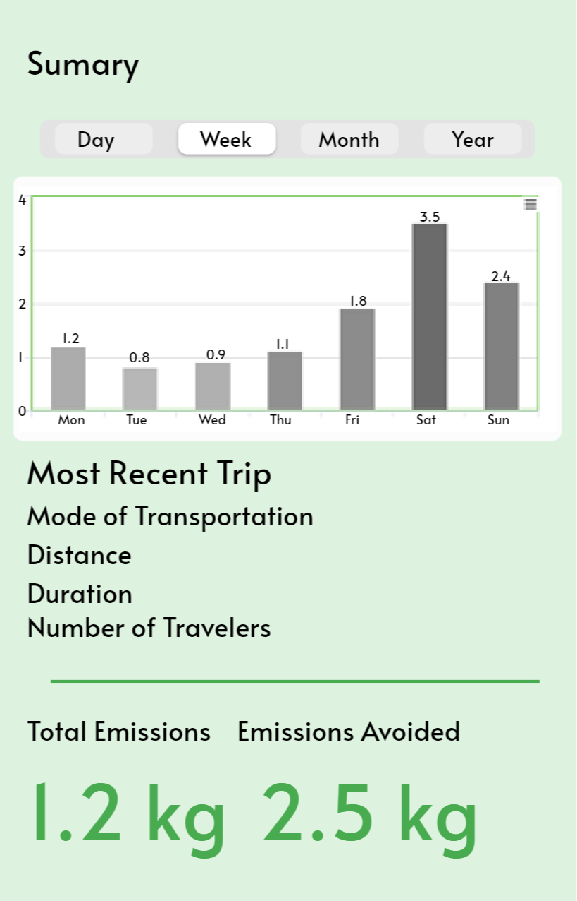

# CarbonPal 

## Overview

Ever wondered what exactly your carbon footprint is. Or have you wondered if its really worth taking the train over the bus or an Uber.

CarbonPal is an website for tracking carbon emissions due to travel. A user can enter their vehicles, modes of transportation and trips and find out how much carbon they are emitting. Additionally they will be able to learn about the different emissions from alternative modes of transportation.


## Data Model

The application will store Users, Lists and Items

* users can have multiple vehicles and trips (via references)
* each trip can have a vehicle in the mode of transportation category (via reference)

An Example User:

```javascript
{
  username: "carbonCrusher",
  hash: // a password hash,
  trips: // an array of references to trip documents,
  vehicles: // an array of references to vehicle documents,
}
```

An Example Vehicle:

```javascript
{
  user: // a reference to a User object
  name: "Chevy Volt 2014",
  company: "Chevrolet",
  model: "Volt",
  year: 2014
  MPG: 35,
  electric: false,
  hybrid: true,
  createdAt: // timestamp
}
```

An Example Trip:

```javascript
{
  user: // a reference to a User object
  name: "trip to work",
  modeOfTransportation: "Bus",
  distance: 3.5,
  duration: 15  
  createdAt: // timestamp
}
```


## [Link to Commented First Draft Schema](db.js) 

## Wireframes

page for creating a new vehicle


page for showing creating a new trip



page for viewing statistics about carbon emissions


page for viewing summary of user's carbon usage



## Site map


## User Stories or Use Cases

1. as non-registered user, I can register a new account with the site
2. as a user, I can log in to the site
3. as a user, I can create a trip and track the carbon related emissions
4. as a user, I can view all of the trips that I have created
5. as a user, I can add a vehicle to use for future logged trips
6. as a user, I can view summary statistics about my carbon emission
7. as a user, I can learn about ways to reduce carbon emissions

## Research Topics

* (2 points) Using Bootstrap
    * I'm going to use Bootstrap to design the CSS of my website
    * I will need to learn how Bootstrap works
* (4 points) Use External APIs
    * I plan to use Google maps API to help track user routes
    * I plan to use other APIs to help provide additional carbon emission statistics such as [CoolClimate API](https://api-central.berkeley.edu/api/11)
* (3 points) Perform Client Side Form Validation with Javascript
    * I plan to use form validation for login and entry for fields related to created vehicles and trips, I have already found some relevant information [here](https://developer.mozilla.org/en-US/docs/Learn/Forms/Form_validation)

9 points total out of 8 required points


## [Link to Initial Main Project File](app.js) 

## Annotations / References Used

1. [Form Validation](https://developer.mozilla.org/en-US/docs/Learn/Forms/Form_validation)
2. [Google Maps API](https://developers.google.com/maps/documentation/javascript/overview) - (add link to source code that was based on this)
3. [CoolClimate API](https://api-central.berkeley.edu/api/11)
